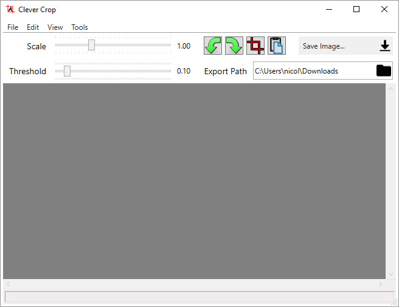

Clever Crop was created for scanned receipts; That means that it expects black/dark-colored content on a white/light-colored background. The cropping algorithm is naive compared to some commercial applications, but does the job in most cases. Clever Crop can be registered as an image viewer from the `Tools->Register Supported File Types` menu if needed to integrate with scanning software. Drag and Drop is also supported.

